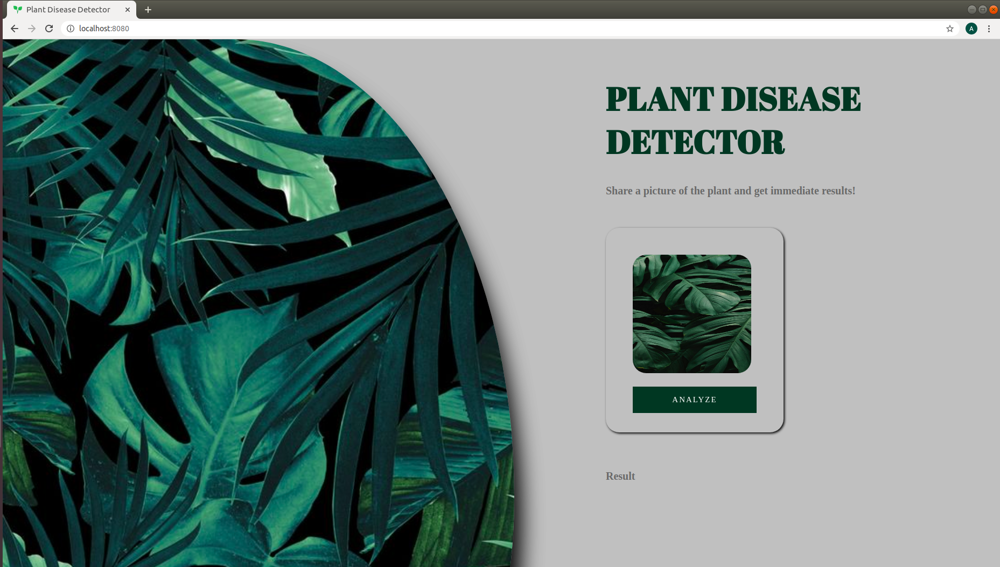

## Plant Disease Detector
<br>

<br>
<p align="center">
  <sub>
    Created by
    <a href="https://github.com/imskr">
      <strong>Shubham Kumar </strong>
    </a>
    <strong>and</strong>
    <a href="https://github.com/imskr/Plant_Disease_Detection/graphs/contributors">
      <strong>other contributors</strong>
    </a>
  </sub>
</p>
<hr noshade>
<br>

## My Article in [TowardsDataScience](https://t.co/iVmRCeUiDI?amp=1)

Models are trained on the preprocessed dataset which can be downloaded [here](https://drive.google.com/open?id=0B_voCy5O5sXMTFByemhpZllYREU).

## Local Set-Up
### Local:
- It is recommended to set up the project inside a virtual environment to keep the dependencies separated.
    * [Python](https://realpython.com/python-virtual-environments-a-primer/#why-the-need-for-virtual-environments)
    * [Conda](https://docs.conda.io/projects/conda/en/latest/user-guide/tasks/manage-environments.html)
- Activate your virtual environment.
- Install dependencies by running `pip install -r requirements.txt`.
- Start up the server by running `python app/server.py serve`.
- Visit <http://localhost:8080/> to explore and test.

### Docker:
*Make Sure the Docker is installed in your local Machine. [Click Here](https://docs.docker.com/install/) to know that how to install Docker*.
- **Mac:**
  ```bash
  $ git clone https://github.com/imskr/Plant_Disease_Detection.git
  $ cd Plant_Disease_Detection
  $ docker build -t fastai-v3 .
  $ docker run --rm -it -p 8080:8080 fastai-v3
  ```
  **Go to http://localhost:8080/ to test your app.**

- **Windows:**
  ```PowerShell or Command Prompt
  $ git clone https://github.com/imskr/Plant_Disease_Detection.git
  $ cd Plant_Disease_Detection
  $ docker build -t fastai-v3 .
  $ docker run --rm -it -p 8080:8080 fastai-v3
  ```
  **Go to http://localhost:8080/ to test your app.**

  **Note:** Windows 10 Pro required.

- **Linux:**
  ```Terminal
  $ git clone https://github.com/imskr/Plant_Disease_Detection.git
  $ cd Plant_Disease_Detection
  $ docker build -t fastai-v3 .
  $ docker run --rm -it -p 8080:8080 fastai-v3
   ```
   **Note:** If this doesn't work use `--no-cache` flag in the build command.

  **Go to http://localhost:8080/ to test your app.**

## Deployment

- **Google Cloud Platform:**

  The complete guideline to deploy the *Plant Disease Detection App* can be found [*here*](./deployment_guide/gcp_deployment.md)
  
- **AWS Elastic BeanStalk:**
  
  The complete guideline to deploy the *Plant Disease Detection App* can be found [*here*](./deployment_guide/aws_deployment.md)


## Server Set-Up  (For Training)
- **Google Cloud Platform (Intermediate)** - The complete tutorial can be found [*here*](https://course.fast.ai/start_gcp.html)

- **Gradient (Easy)** -  The complete tutorial can be found [*here*](https://course.fast.ai/start_gradient.html)

- **AWS EC2 (Advance)** - The complete tutorial can be found [*here*](https://course.fast.ai/start_aws.html)

## Dataset Description:

|Name           | No of Classes | Class Names
| ------------- |:-------------:|:-----------------:|
| Apple     |     04        | 'Apple___Apple_scab','Apple___Black_rot','Apple___Cedar_apple_rust' 'Apple___healthy' |
| Blueberry |     01        | 'Blueberry___healthy' |
| Cherry    |     02        | 'Cherry_(including_sour)_Powdery_mildew', 'Cherry_(including_sour)_healthy' |
| Corn      |     04        | 'Corn___Cercospora_leaf_spot', 'Corn___Common_rust','Corn___Northern_Leaf_Blight','Corn___healthy' |
| Grape     |     04        | 'Grape___Black_rot','Grape___Esca_(Black_Measles)','Leaf_blight_(Isariopsis_Leaf_Spot)','Grape___healthy' |
| Orange    |     01        | 'Orange___Haunglongbing_(Citrus_greening)' |
| Peach     |     02        | 'Peach___Bacterial_spot','Peach___healthy' |
| Pepper    |     02        | 'Pepper,_bell___Bacterial_spot','Pepper,_bell___healthy' |
| Potato    |     03        | 'Potato___Early_blight','Potato___Late_blight','Potato___healthy' |
| Raspberry |     01        | 'Raspberry___healthy' |
| Soyabean  |     01        | 'Soybean___healthy' |
| Squash    |     01        | 'Squash___Powdery_mildew' |
| Strawberry|     02        | 'Strawberry___Leaf_scorch','Strawberry___healthy' |
| Tomato    |     10        | Tomato: 'Bacterial_spot','Early_blight', 'Late_blight', 'Leaf_Mold', 'Septoria_leaf_spot', 'Spider_mites','Target_Spot', 'Yellow_Leaf_Curl_Virus', 'Mosaic_virus', 'Healthy' |

Before making your valuable contribution to this project do check [CONTRIBUTING.md](https://github.com/imskr/Plant_Disease_Detection/blob/master/CONTRIBUTING.md) file.

## Citation
When using any part of this repo, please cite: [Plant Village Paper](https://arxiv.org/abs/1511.08060).

<br>
<p align='center'>
  <a href="https://www.buymeacoffee.com/imskr" target="_blank"></a>
</p>
