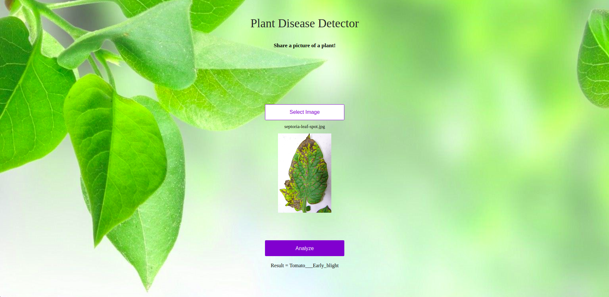

## Plant Disease Detector
 

 

  Created by <a href="https://github.com/imskr"><strong>Shubham Kumar</strong></a>

 

## Visit: [Plant-Disease-Detector](http://plantdisease.ap-south-1.elasticbeanstalk.com/)

## My Article in [TowardsDataScience](https://t.co/iVmRCeUiDI?amp=1)

Training and evaluating state-of-the-art deep architectures for plant disease classification task using pyTorch.  
Models are trained on the preprocessed dataset which can be downloaded [here](https://drive.google.com/open?id=0B_voCy5O5sXMTFByemhpZllYREU). 
Dataset is consisted of **38** disease classes from [PlantVillage](https://plantvillage.org/) dataset and **1** background class from Stanford's open dataset of background images - [DAGS](http://dags.stanford.edu/projects/scenedataset.html).
 
**80%** of the dataset is used for training and **20%** for validation.
 

## Configuration
| Model        | Library |Training Platform | Accuracy |
| ------------- |:-------------:|:-----------------:|:-------------:|
| Resnet34       | Fastai      |    Google Cloud Platform           |   99.654%     | 

## Dataset Description:

|Name           | No of Classes | Class Names
| ------------- |:-------------:|:-----------------:|
| Apple     |     04        | 'Apple___Apple_scab','Apple___Black_rot','Apple___Cedar_apple_rust' 'Apple___healthy' |
| Blueberry |     01        | 'Blueberry___healthy' |
| Cherry    |     02        | 'Cherry_(including_sour)_Powdery_mildew', 'Cherry_(including_sour)_healthy' |
| Corn      |     04        | 'Corn___Cercospora_leaf_spot', 'Corn___Common_rust','Corn___Northern_Leaf_Blight','Corn___healthy' |
| Grape     |     04        | 'Grape___Black_rot','Grape___Esca_(Black_Measles)','Leaf_blight_(Isariopsis_Leaf_Spot)','Grape___healthy' |
| Orange    |     01        | 'Orange___Haunglongbing_(Citrus_greening)' |
| Peach     |     02        | 'Peach___Bacterial_spot','Peach___healthy' |
| Pepper    |     02        | 'Pepper,_bell___Bacterial_spot','Pepper,_bell___healthy' |
| Potato    |     03        | 'Potato___Early_blight','Potato___Late_blight','Potato___healthy' |
| Raspberry |     01        | 'Raspberry___healthy' |
| Soyabean  |     01        | 'Soybean___healthy' |
| Squash    |     01        | 'Squash___Powdery_mildew' |
| Strawberry|     02        | 'Strawberry___Leaf_scorch','Strawberry___healthy' |
| Tomato    |     10        | Tomato: 'Bacterial_spot','Early_blight', 'Late_blight', 'Leaf_Mold', 'Septoria_leaf_spot', 'Spider_mites','Target_Spot', 'Yellow_Leaf_Curl_Virus', 'Mosaic_virus', 'Healthy' |

 

  

