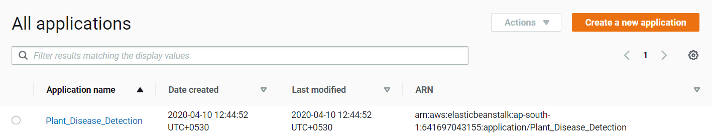
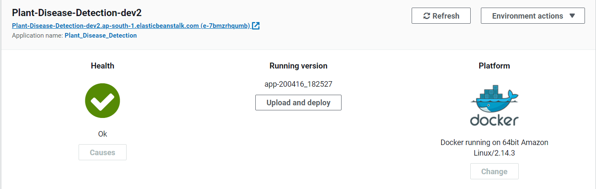

# Deploy Plant Disease Detection on AWS Elastic Beanstalk

## Setup

### What you need

- A Local workspace
- *EB CLI* installed and configured in your Local workspace.
    *If you don't have EB CLI installed, then [Click Here](https://docs.aws.amazon.com/elasticbeanstalk/latest/dg/eb-cli3-install.html)*
- A *Amazon Web Services* account
- Billing enabled to access the *APIs* and Featues we need

**After fulfilling the requirements, you can go through the proesss**

## Check EB CLI
Open the Terminal/Command Prompt and
Enter the following command to check

```bash
eb --version
```

Output:
```bash
EB CLI 3.17.1 (Python 3.7.4)
```

> *If it shows any **Error** then reinstall your EB CLI*

## Download the Plant Disease Detection app

Enter the following command to clone the app repository to your Local Workspace and Go to the directory that contains the code
    
```bash
git clone https://github.com/imskr/Plant_Disease_Detection.git
cd Plant_Disease_Detection
```

## Initialize the Elastic Beanstalk

1. Enter the following command to initialize the EB

   ```bash
   eb init
   ```
 
   Output:
 
   ```bash
   Select a default region
   1) us-east-1 : US East (N. Virginia)
   2) us-west-1 : US West (N. California)
   3) us-west-2 : US West (Oregon)
   4) eu-west-1 : EU (Ireland)
   5) eu-central-1 : EU (Frankfurt)
   6) ap-south-1 : Asia Pacific (Mumbai)
   7) ap-southeast-1 : Asia Pacific (Singapore)
   8) ap-southeast-2 : Asia Pacific (Sydney)
   9) ap-northeast-1 : Asia Pacific (Tokyo)
   10) ap-northeast-2 : Asia Pacific (Seoul)
   11) sa-east-1 : South America (Sao Paulo)
   12) cn-north-1 : China (Beijing)
   13) cn-northwest-1 : China (Ningxia)
   14) us-east-2 : US East (Ohio)
   15) ca-central-1 : Canada (Central)
   16) eu-west-2 : EU (London)
   17) eu-west-3 : EU (Paris)
   18) eu-north-1 : EU (Stockholm)
   19) ap-east-1 : Asia Pacific (Hong Kong)
   20) me-south-1 : Middle East (Bahrain)
   (default is 3):
   ```
  
2. Select a deployment region
   *For India, choose the **ap-south-1***
  
   Enter **6**
  
   Output:
 
   ```bash
   Enter Application Name
   (default is "Plant_Disease_Detection"):
   ```
  
3. Select the application
   The *Plant_Disease_Detection* should be on the default.
  
   So, select the Default value *Press **Enter***
  
   Output:
 
   ```bash
   It appears you are using Docker. Is this correct?
   (Y/n):
   ```
  
4. Additional options
   - As we are using docker, So enter **Y**
   - Select the **docker version**. (If Any)
   - Don't need to use the **CodeCommit**. So, enter **N**
   - We don't nees *SSH* for our App, so enter **N**
  
   Complete Output:
  
   ```bash
   It appears you are using Docker. Is this correct?
   (Y/n): y
  
   Select a platform version.
   1) Docker 18.09.9-ce
   2) Docker
   (default is 1):
   Do you wish to continue with CodeCommit? (y/N) (default is n):
   Do you want to set up SSH for your instances?
   (Y/n): n
   ```
  
*After Initialize the app, you can see the creation from AWS Management Condole*

Goto **Elastic Beanstalk > Application** and you can see something like this



## Create the Environment

Enter the following command to create the Environment

```bash
eb create -i t2.large
```

1. Enter the Environment name

   *Select the Default name(**Plant-Disease-Detection-dev**)* or You can give your own name
  
2. Enter the CNAME prefix
  
   *Select the Default CNAME(**Plant-Disease-Detection-dev**)* or You can give your own
  
3. Select the Load balencer
  
   *Select the Default one(**application**)*

4. Would you like to enable Spot Fleet requests for this environment?
      *Enter **N***
  
Complete Output:

```bash
Enter Environment Name
(default is Plant-Disease-Detection-dev):
Enter DNS CNAME prefix
(default is Plant-Disease-Detection-dev):

Select a load balancer type
1) classic
2) application
3) network
(default is 2):

Would you like to enable Spot Fleet requests for this environment?
(y/N):
```

Go to in your `EB Management Console` and you will find the `Application` and `Environment`.



*Elastic Beanstalk will create your environment and deploy it. It will take around 5 minutes*

## Open your app

After successfully deployment, you can open your app by simply typing a command

```bash
eb open
```

or you can Goto you *EB Management Console* and Check the URL

---


```bash
Hope you may understand and deploy the App perfectly.
Thank you
```

Deployment guideline by [Arkadip Bhattacharya](https://github.com/darkmatter18)
