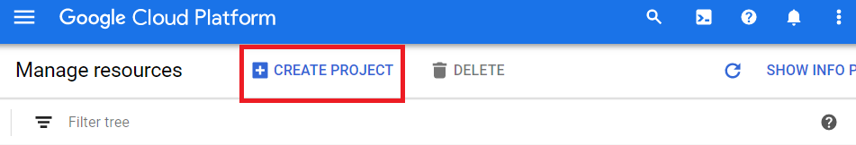
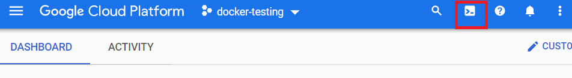
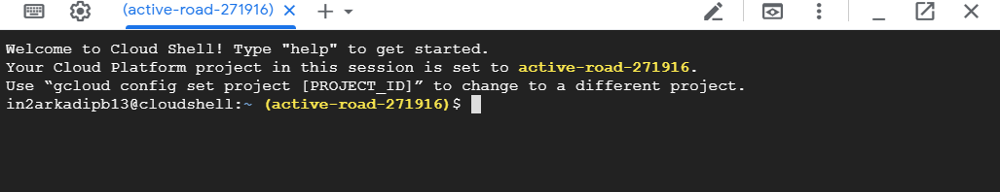

# Deploy Plant Disease Detection on Google Cloud Platform

## Setup

### What you need

- A Google Cloud Console Account
- Billing enabled to access the *APIs* and Featues we need

## Create a new Project

You must create a new project to deploy the *Plant Disease Detection App*

1. Goto the [**Cloud Resource Manager**](https://console.cloud.google.com/cloud-resource-manager) link

2. Click on `New Project` Button. Set a *Project Name* and *Billing Details*



3. Wait for some time, until GCP creates your project

## Activate Google Cloud Shell

Google Cloud Shell is a virtual machine that is loaded with development tools. It provides command-line access to your GCP resources.

1. In GCP console, on the top right toolbar, click the Open Cloud Shell button.



It takes a few moments to provision and connect to the environment. When you are connected, you are already authenticated, and the project is set to your *PROJECT_ID*. 
For example:


## Download the Plant Disease Detection app

Enter the following command to clone the app repository to your Google Cloud instance and Go to the directory that contains the code
    
```bash
git clone https://github.com/imskr/Plant_Disease_Detection.git
cd Plant_Disease_Detection
```

## Create the App Engine Instance

1. Enter the following command to create the *Google App Engine* Instance
    ```bash
    gcloud app create
    ```

    Output:

    ```bash
    Please choose the region where you want your App Engine application
    located:

     [1] asia-east2    (supports standard and flexible)
     [2] asia-northeast1 (supports standard and flexible)
     [3] asia-northeast2 (supports standard and flexible)
     [4] asia-northeast3 (supports standard and flexible)
     [5] asia-south1   (supports standard and flexible)
     [6] australia-southeast1 (supports standard and flexible)
     [7] europe-west   (supports standard and flexible)
     [8] europe-west2  (supports standard and flexible)
     [9] europe-west3  (supports standard and flexible)
     [10] europe-west6  (supports standard and flexible)
     [11] northamerica-northeast1 (supports standard and    flexible)
     [12] southamerica-east1 (supports standard and flexible)
     [13] us-central    (supports standard and flexible)
     [14] us-east1      (supports standard and flexible)
     [15] us-east4      (supports standard and flexible)
     [16] us-west2      (supports standard and flexible)
     [17] us-west3      (supports standard and flexible)
     [18] cancel
     Please enter your numeric choice: 
    ```

2. Select your nearby location and Enter the numeric choice.
    
    *For India, choose the **asia-south1***

    Output:
    ```bash
    Creating App Engine application in project [machine-learning-271713] and region [asia-south1]....done.
    Success! The app is now created. Please use `gcloud app deploy` to deploy your first app.
    ```

It will take some times to create the *App engine* and should produce no error.

## Deploy your app

To deploy the app to App Engine, run the following command from within the root directory of the application where the *app.yaml* file is located:

```bash
gcloud app deploy
```

Output:
```bash
Services to deploy:

descriptor:      [/home/********/Plant_Disease_Detection/app.yaml]
source:          [/home/********/Plant_Disease_Detection]
target project:  [machine-learning-271713]
target service:  [default]
target version:  [20200323t114020]
target url:      [https://machine-learning-271713.appspot.com]


Do you want to continue (Y/n)?
```

Enter **Y** when prompted to confirm the details and begin the deployment of service.

> Now Wait for Some time for the application to build. It will take around 15 minutes to done.

## View your application

To launch your browser enter the following command, then click on the link it provides.

```bash
gcloud app browse
```
It will give you time link of the application.

## Delete the Applicaion

1. To **Disable the applicacion**,
Go into the [App Engine Settings](https://console.cloud.google.com/appengine/settings) and disable the app

    *Remember it'll not delete the resourses and data*

2. To **Completely remove the application**
Remove the project from the [**Cloud Resource Manager**](https://console.cloud.google.com/cloud-resource-manager)

```bash
Hope you may understand and deploy the App perfectly.
Thank you
```

Deployment guideline by [Arkadip Bhattacharya](https://github.com/darkmatter18)
